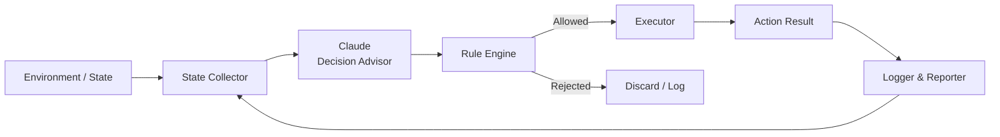

# System Architecture

## Component Responsibilities

### State Collector
Collects real-time system signals, balances, and execution context.
This module does not execute actions.

### Claude Decision Advisor
Provides high-level action proposals based on observed state.
Claude has no direct execution capability and cannot bypass rules.

### Rule Engine
Validates all proposed actions against predefined constraints,
risk limits, and safety policies.

### Executor
Performs approved actions using isolated execution credentials.
All executions are deterministic and auditable.

### Logger & Reporter
Records decisions, actions, and outcomes for transparency and
periodic reporting.
